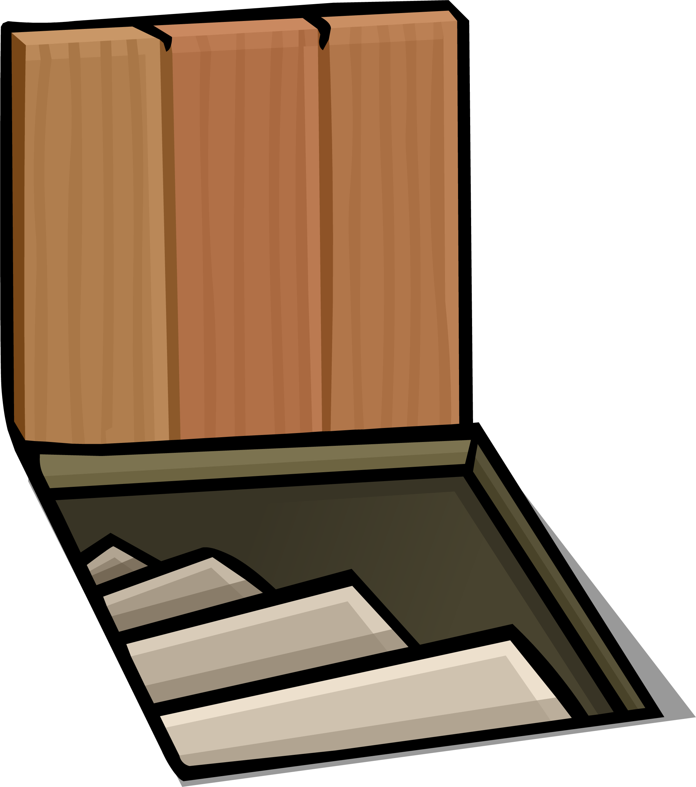
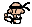

## A SMILING NIGHTMARE

What if you found yourself in a basement with aggressive martial artists and clowns all around you?
What if they quickly adapted to your style, specifically to make you miserable?
And what if you couldn't stop smiling, while you were trying to escape?

A Smiling Nightmare answers this question exactly.

You will play as a nice, cute smile trying to reach the stairs to get out of a weird basement.

But it's not going to be that easy!
In each room you visit there are going to be enemies going for your head (especially considering you literally have nothing else...)

# How to play
You can use WASD to roam around the rooms freely.
You cannot pass walls and you won't be able to escape a room until you clear all the enemies inside it.
To do so, you have two ways of dealing damage: pressing one of the directional arrows allows you to shoot a shot in that direction, which will damage the first enemy it collides with, or disappear if it hits a wall.
Instead, if you hold the spacebar while pressing a directional arrow, you're going to perform a swing attack that damages all the enemies nearby; use it carefully, because even though it deals more damage than the shots its range is quite limited!

Once you've cleared a room, you can reach one of the open borders to go to the next one; enemies won't respawn if you visit a room you've cleared already.

# The trapdoor

This is your escape from this nightmare!

It will appear in a single room when you've cleared it; go near it to escape and win!

# The enemies
 

These two are the enemies you're going to face in your journey.

The **karateka** will chase you down, trying to hurt you.
Sometimes, he will also try to perform a flying kick on you; beware of the sound he makes and the position he assumes before doing so, and when you see it, prepare to dodge!

The **clown** instead won't try to reach you (even though touching him still hurts), trying instead to shoot you from afar.
Be careful, because sometimes he will go berserk and self-destruct!
Beware of the histerical laughter he makes and the green texture he takes when doing so, 